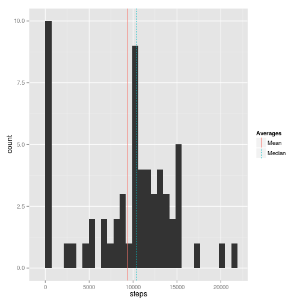
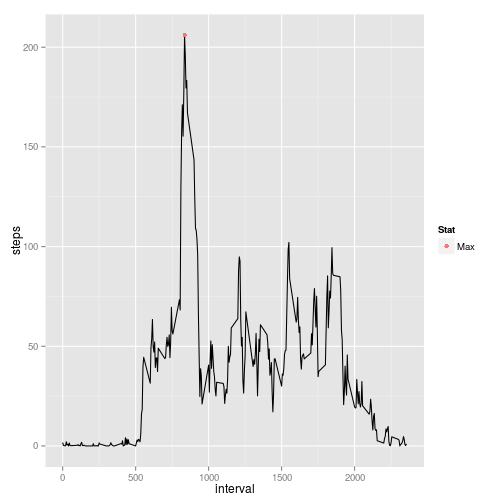
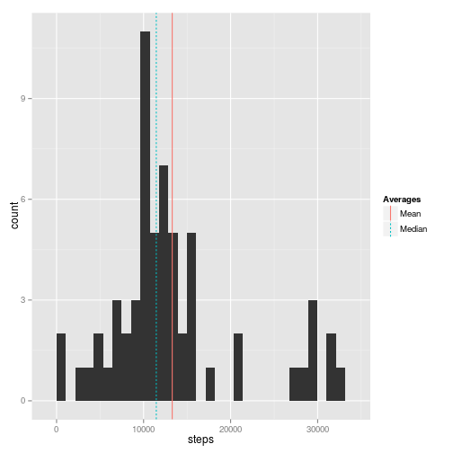
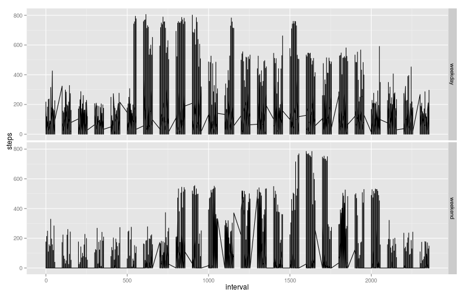

## Loading and preprocessing the data

First of all: load libraries.

```r
library(dplyr)
library(lubridate)
library(ggplot2)
library(Amelia)
```

You probably prefer to skip most of this section code, just read the first lines and go to the last lines. Knowing that data should be in a zip in the working folder, the first conditional checks for the zip file and the abscence of the csv file. But I reproduce here all the steps I usually apply to be certain that data WILL BE THERE (where?). Non obvious steps taken: load data as `tbl_df` (`dplyr`), and mutate `date` to `POSIXct` (`lubridate`).

```r
dataDir <- "./data/"                    # As everyone has preeferences about
                                        #working dirs and staff; set your own.
fileName <- "activity.zip" # Yep, zip file name too (if you wish).
dataFile <- "activity.csv"              # ...and data file.
fileRute <- paste(dataDir, fileName, sep = "")  # Putting all together for the
dataRute <- paste(dataDir, dataFile, sep = "")  #upcoming.

fileUrl <- "https://d396qusza40orc.cloudfront.net/repdata%2Fdata%2Factivity.zip"

# If there's a zip in working folder, and no activity.csv in dataDir: unzip!
if(file.exists(fileName) & !file.exists(dataRute)) {    
        if(!dir.exists(dataDir)) {              # check dir...
                        dir.create(dataDir)     # and create it if needed.
                }
        unzip(fileName, exdir = dataDir)
}

# If zip isn't right in the working dir: search, download, unzip, bite!
if(!file.exists(dataFile)) {            # If you don't have the data here...
        if(!file.exists(fileRute)) {    # check for the zip file in dataDir
                if(!dir.exists(dataDir)) {      # ...if not there, check dir...
                        dir.create(dataDir)     # and create it if needed.
                }
                download.file(fileUrl, fileRute, method = "curl") # Now dwnload
        }                               # Maybe you didn't want it, won't hurt.
        if(!file.exists(dataRute)) {    # Check for the actual data file.
                unzip(fileRute, exdir = dataDir)       # If not there, unzip!
        }
} else {
        dataRute <- dataFile    # Well, of course, if the data was there from
                                #the start, skip all; just redefine dataRute.
}

activityData <- read.csv(dataRute)      # Simple: load data (as tbl_df)
activity <- activityData
activity <- tbl_df(activity) %>%
        mutate(date = ymd(activity$date))      # Convert dates to POSIXct
```

## What is mean total number of steps taken per day?


```r
stepsbyday <- activity %>%      # group by date and calculate sum
        group_by(date) %>%
        summarize(steps = sum(steps, na.rm = TRUE))
```


```r
stepsVals <- c(mean(stepsbyday$steps, na.rm = TRUE),    # Create a little table
      median(stepsbyday$steps, na.rm = TRUE))           #with mean and median;
stepsStat <- c("Mean", "Median")                        #maybe not necessary,
stepsAvg <- matrix(nrow = 2, ncol = 2)
stepsAvg <- data.frame(stepsAvg) %>%                    #but easier to plot
        tbl_df() %>%
        mutate(X1 = stepsStat, X2 = stepsVals) %>%
        rename(Averages = X1, Values = X2)
```


```r
# default ggplot2 histogram, since automatic breaks seems a good compromise
qplot(steps, data = stepsbyday, geom = "histogram", show_guide = T) +
        geom_vline(data = stepsAvg,             # Add vertical lines of mean and
                   aes(xintercept = Values,     #median
                   colour = Averages, linetype = Averages), show_guide = T)
```

 

Here is presented the histogram -not the barplot, as emphasized in the instructions-  __of the single variable__ *total steps per day*. This means that the plot presents the count of the days where `x` steps were taken. As you can see there are 9 days with just over 10000 steps taken, or 5 days with just over 15000 steps takes, or 10 days with almost none steps taken, etcetera.

The __mean (9354.23)__ of *steps takes per day*, and the __median (10395)__ are also ploted as a red and a pointed-green lines respectively.

## What is the average daily activity pattern?

```r
stepsbyint <- activity %>%      # group by interval and calculate mean
        group_by(interval) %>%
        summarize(steps = mean(steps, na.rm = TRUE))
```


```r
maxVal <- max(stepsbyint$steps, na.rm = TRUE)    # Create a little table
maxInt <- stepsbyint$int[which(stepsbyint$steps == maxVal)]
                                                       #max;
labMax <- c("Max")                        #maybe not necessary,
stepsMax <- matrix(nrow = 1, ncol = 3)             #but easier to plot
stepsMax <- data.frame(stepsMax) %>%
        tbl_df() %>%
        mutate(X1 = labMax, X2 = maxVal, X3 = maxInt) %>%
        rename(Stat = X1, yValue = X2, xValue = X3)
```


```r
# default ggplot2 line graph
qplot(interval, steps, data = stepsbyint, geom = "line", show_guide = T) +
        geom_point(data = stepsMax,             # Add point for maximum
                   aes(x = xValue, y = yValue, colour = Stat), show_guide = T)
```

 

This plot shows the average of steps taken at every 5 min interval across all days. The **maximum (206.17)** average , i.e. median, of steps taken per interval across all days is ploted as a red dot.

## Imputing missing values

```r
NAs <- sum(!complete.cases(activity))
```
There are **2304 missing** values, *i.e.* non-complete cases.


```r
activityImp <- as.data.frame(activity)
imp <- amelia(activityImp, # Impute values with Amelia package
              bound = rbind(c(1, 0, Inf), c(2, 0, Inf), c(3, 0, Inf)))
```

```
## -- Imputation 1 --
## 
##   1  2
## 
## -- Imputation 2 --
## 
##   1  2
## 
## -- Imputation 3 --
## 
##   1  2
## 
## -- Imputation 4 --
## 
##   1  2
## 
## -- Imputation 5 --
## 
##   1  2
```

```r
activityImp1 <- imp[["imputations"]][[1]]
activityImp1 <- tbl_df(activityImp1) %>%
        mutate(steps = as.integer(round(steps, 0))) # round imputations to integer
```


```r
stepsbyday2 <- activityImp1 %>%      # group by date and calculate sum
        group_by(date) %>%
        summarize(steps = sum(steps, na.rm = TRUE))
```


```r
stepsVals2 <- c(mean(stepsbyday2$steps, na.rm = TRUE),    # Create a little table
      median(stepsbyday2$steps, na.rm = TRUE))           #with mean and median;
stepsStat2 <- c("Mean", "Median")                        #maybe not necessary,
stepsAvg2 <- matrix(nrow = 2, ncol = 2)
stepsAvg2 <- data.frame(stepsAvg2) %>%                    #but easier to plot
        tbl_df() %>%
        mutate(X1 = stepsStat2, X2 = stepsVals2) %>%
        rename(Averages = X1, Values = X2)
```


```r
# default ggplot2 histogram, since automatic breaks seems a good compromise
qplot(steps, data = stepsbyday2, geom = "histogram", show_guide = T) +
        geom_vline(data = stepsAvg2,             # Add vertical lines of mean and
                   aes(xintercept = Values,     #median
                   colour = Averages, linetype = Averages), show_guide = T)
```

 

Here is presented the histogram  __of the single variable__ *total steps per day*, for the imputed dataset. The __mean (13291.23)__ of *steps takes per day*, and the __median (11458)__ for imputed dataset are also ploted as a red and a pointed-green lines respectively. With the imputation, both average measures have changed. Nonetheless, the **median increased** 'only' **1063**, while the **mean** has **increased 3937**. The data has changed from being biased towards low numbers ("to the left"), to a bias towards higher numbers ("to the right").

## Are there differences in activity patterns between weekdays and weekends?


```r
activityWeek <- activityImp1
activityWeek <- tbl_df(activityWeek) %>%        # Creating weekday/end factor
        mutate(weekday = wday(date))
activityWeek <- activityWeek %>%
        mutate(weekend = c(activityWeek$weekday %in% c(7, 1))) %>%
        mutate(weekend = factor(weekend, labels = c("weekday", "weekend")))
```


```r
# default ggplot2 line graph with panels or facets by weekday/end
qplot(interval, steps, data = activityWeek, geom = "line", facets = weekend~.)
```

 

This last graph, done with ggplot2 instead of lattice as was in the example, shows the mean of steps per interval for weekdays (up) and weekend (down), as the labels at the right indicates.
